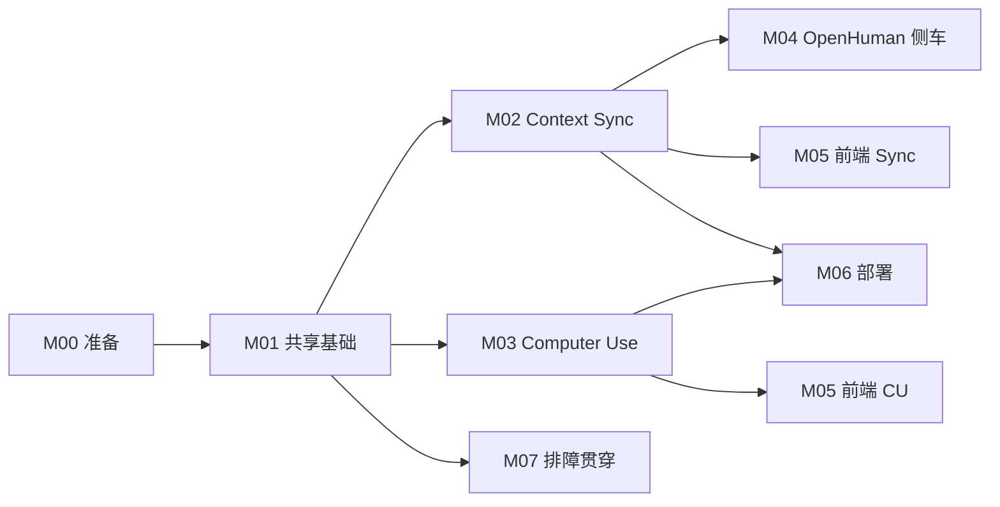

# 01 — 模块依赖与实施顺序

---

## 甘特建议（人周）

| 周 | 后端 | 前端 | 运维 |
|----|------|------|------|
| W1 | M00+M01 | — | — |
| W2–3 | M02-a,b,c OAuth+Gmail | — | Beat 容器 |
| W4 | M02-d,e pipeline+prompt | M05 Sync | — |
| W3–5 | M03 Runner+orchestrator | M05 CU | compose CU |
| W5–6 | M04 sidecar API | 绑定 UI | 生产试点 |
| W6 | 联调 | 联调 | M06 全量 |

---

## 并行规则

- M03 **不得** 修改 `context_sync/fetchers/*`
- M04 **仅** 调用 `pipeline.ingest_items`，不复制 fetcher
- M05 仅调 API，不写业务逻辑

---

## PR 合并顺序

1. M01 必须先于 M02/M03 合并到 main
2. M02 与 M03 可并行 PR，但 **M06 部署 beat** 依赖 M02-d
3. M04 依赖 M02-e（ingest 管道）

---

## 检查点（每周）

- [ ] `docs/development/附录` 与代码 capability id 一致
- [ ] 新 env 已写入 `deploy` 示例与 M06
- [ ] 07 排障手册新增条目（本周新 error 码）
